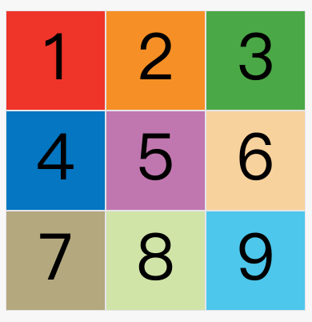

# Grid 网格布局

1.  简介

    将网页划分成了一个一个网格，可以任意组合不同的网格，做出各种各样的布局，以前只能用框架实现，现在Css就可以实现了

   - 与Flex 布局的相似性
     - 都可以指定内部多个项目（子节点）的位置
   - 与Flex布局的区别
     - flex是轴线布局， 可以看做事一维布局
     - grid 是将容器分成了 行 和列的概念，产生单元格，可以看做是二维布局

2. 基本概念

   - 容器和项目：最外层的元素就是容器，内部第一层的子元素就是项目，孙级的不算项目

   - 行和列：容器里面，水平区域称为行row, 垂直区域称为列column
   - 单元格： 行线和列线交叉，产生的区域就是单元格
   - 网格线grid line: 水平网格线划分出行，垂直网格线划分出列

3. 容器属性

   ```javascript
   // 1. 容器的属性  定义在容器上的属性 
   
     // display
      div {
          display: grid; // 代表此时是一个网格，且网格是一个块状元素
      }
   
      div {
          dispaly: inline-grid; //  此时是一个网格，是一个行内元素
      }
       
   
     // grid-template-columns 列宽 和  grid-template-rows 行高
      // 指定一个三行三列的网格  且每个网格的宽度和高度都为100px
        div {
            display: grid;
            grid-template-columns: 100px 100px 100px; // 代表有三列 每个单元格列宽为100px
            grid-template-rows: 100px 100px  100px; // 代表有三行，每个单元格行高为100px
        }
      // 还可以使用百分比
        div {
            display: grid;
            grid-template-columns: 33.3%, 33.3%, 33.3%;
            grid-template-rows: 33.3%, 33.3%, 33.3%;
        }
   ```

   - repeat() 属性  重复

     ```javascript
     // repeat() 属性，如果每一行一列的单元格比较多，总不能一个一个手写过去吧，简写的写法
     // 接收两个参数， 一个是重复的次数， 一个是需要重复的值
         div {
             display: grid;
             grid-template-colums: repeat(3, 33.3%);  // 代表有三列，每一列 列宽为33.3%
             grid-template-rows: repeat(3, 33.3%); // 代表有三行，每一行 行高为33.3%
         }
     // 当然 接收的第二个参数， 可以不止一个值， 可以多个， 循环重复
         div {
             display: grid;
             grid-template-columns: repeat(2, 100px 30px 80px); // 重复两次，也就是有六列
         }
     ```

   - auto-fill 关键字

     ```javascript
     // 又时候，单元格的大小是固定的，但是容器的大小是不固定的，如果希望每一行，尽量多的容纳单元格，这个时候可以使用自动填充
     
        div {
            diaplay: grid;
            // 每列宽 为100px  自动填充，知道不能放更多的列
            grid-template-columns: repeat(auto-fill, 100px);
        }
     ```

   - fr 关键字

     ```javascript
     // 表示比例关系
       div {
           display: grid;
           grid-template-columns: 150px 1fr 2fr; // 第一列的宽度为150像素，第二列的宽度是第三列的一半。
       }
     ```

   - minmax() 关键字  表示一个长度范围

     ```javascript
     // minmax(100px, 1fr)表示列宽不小于100px，不大于1fr。
     grid-template-columns: 1fr 1fr minmax(100px, 1fr);
     ```

   - auto 关键字

     ```javascript
     // 表示由浏览器自己决定长度
     //第二列的宽度，基本上等于该列单元格的最大宽度，除非单元格内容设置了min-width，且这个值大于最大宽度。
     grid-template-columns: 100px auto 100px;
     ```

   - 网线名称

     ```javascript
     //grid-template-columns属性和grid-template-rows属性里面，还可以使用方括号，指定每一根网格线的名字，方便以后的引用。
     //网格布局允许同一根线有多个名字，比如[fifth-line row-5]。
     .container {
       display: grid;
       grid-template-columns: [c1] 100px [c2] 100px [c3] auto [c4];
       grid-template-rows: [r1] 100px [r2] 100px [r3] auto [r4];
     }
     ```

   - grid-row-gap， grid-column-gap, grid-gap

     ```javascript
     // grid-row-gap 行与行之间的间隔
     // grid-column-gap 列与列之间的间隔
     // grid-gap 行 和 列  的合并写法
        div {
            grid-column-gap: 20px;  // 最新写法 为  column-gap: 20px;
            grid-row-gap: 30px;  // 最新写法为 row-gap: 30px'
            
            // 相当于
            grid-gap: 30px 20px; // 最新写法为 gap: 30px 20px;
        }
     
      # 根据最新标准，上面三个属性名的grid-前缀已经删除，grid-column-gap和grid-row-gap写成column-gap和row-gap，grid-gap写成gap。gap: 30px 20px;
     ```

   - grid-template-areas 属性

     ```javascript
     // 网格布局允许指定"区域"（area），一个区域由单个或多个单元格组成。grid-template-areas属性用于定义区域。
     
     grid-template-areas: "header header header"
                          "main main sidebar"
                          "footer footer footer";
     
     // 不需要的区域用·表示
     grid-template-areas: 'a . c'
                          'd . f'
                          'g . i';
     
     # 注意，区域的命名会影响到网格线。每个区域的起始网格线，会自动命名为区域名-start，终止网格线自动命名为区域名-end。
     
     # 比如，区域名为header，则起始位置的水平网格线和垂直网格线叫做header-start，终止位置的水平网格线和垂直网格线叫做header-end。
     ```

   - grid-auto-flow 属性

     ```javascript
     // 代表容器的填充顺序
     div {
         grid-auto-flow: row; // 默认是先行后列， 按顺序进行排列
         grid-auto-flow： column; // 先列后行，按顺序排列
         
         grid-auto-flow: row dense; // 先行后列 但是会尽可能的紧密填满，不出现空格
         grid-auto-flow: column dense; // 先列后行 但是会尽可能的紧密填满，不出现空格
     }
     ```

     - row

       

     -  column

       

     - row-dense

       

     - column-dense

       

   - justify-item 属性， align-items 属性，place-items属性

     ```javascript
     // justify-item 属性设置单元格内容的水平位置（左中右）
     // align-items属性设置单元格内容的垂直位置（上中下）。
     .container {
       justify-items: start | end | center | stretch;
       align-items: start | end | center | stretch;
     }
     start：对齐单元格的起始边缘。
     end：对齐单元格的结束边缘。
     center：单元格内部居中。
     stretch：拉伸，占满单元格的整个宽度（默认值）
     
     //place-items属性是align-items属性和justify-items属性的合并简写形式。
     
     place-items: <align-items> <justify-items>;
     place-items: start end;
     ```

   - justify-content属性， align-content 属性， place-content 属性

     ```javascript
     // justify-content属性是整个内容区域在容器里面的水平位置（左中右）
     // align-content属性是整个内容区域的垂直位置（上中下）。
     .container {
       justify-content: start | end | center | stretch | space-around | space-between | space-evenly;
       align-content: start | end | center | stretch | space-around | space-between | space-evenly;  
     }
     start - 对齐容器的起始边框
     end - 对齐容器的结束边框。
     center - 容器内部居中。
     stretch - 项目大小没有指定时，拉伸占据整个网格容器。
     space-around - 每个项目两侧的间隔相等。所以，项目之间的间隔比项目与容器边框的间隔大一倍。
     space-between - 项目与项目的间隔相等，项目与容器边框之间没有间隔。
     space-evenly - 项目与项目的间隔相等，项目与容器边框之间也是同样长度的间隔。
     // place-content属性是align-content属性和justify-content属性的合并简写形式。
     ```

   - grid-auto-columns, grid-auto-rows

     ```javascript
     //grid-auto-columns属性和grid-auto-rows属性用来设置，浏览器自动创建的多余网格的列宽和行高。它们的写法与grid-template-columns和grid-template-rows完全相同。如果不指定这两个属性，浏览器完全根据单元格内容的大小，决定新增网格的列宽和行高。
     
     .container {
       display: grid;
       grid-template-columns: 100px 100px 100px;
       grid-template-rows: 100px 100px 100px;
       grid-auto-rows: 50px; 
     }
     ```

   - grid, grid-template

     ```javascript
     grid-template属性是grid-template-columns、grid-template-rows和grid-template-areas这三个属性的合并简写形式。
     
     grid属性是grid-template-rows、grid-template-columns、grid-template-areas、 grid-auto-rows、grid-auto-columns、grid-auto-flow这六个属性的合并简写形式。
     
     从易读易写的角度考虑，还是建议不要合并属性，所以这里就不详细介绍这两个属性了。
     ```

4. 项目属性

   - grid-column-start, grid-column-row, grid-row-start, grid-row-end

     ```javascript
     grid-column-start属性：左边框所在的垂直网格线
     grid-column-end属性：右边框所在的垂直网格线
     grid-row-start属性：上边框所在的水平网格线
     grid-row-end属性：下边框所在的水平网格线
     
     .item-1 {
       grid-column-start: 2;
       grid-column-end: 4;
     }
     
     .item-1 {
       grid-column-start: 1;
       grid-column-end: 3;
       grid-row-start: 2;
       grid-row-end: 4;
     }
     
     //还可以指定为网格线的名字。
     
     .item-1 {
       grid-column-start: header-start;
       grid-column-end: header-end;
     }
     
     //这四个属性的值还可以使用span关键字，表示"跨越"，即左右边框（上下边框）之间跨越多少个网格。
     
     
     .item-1 {
       grid-column-start: span 2; // 跨越2  到3  想成 加法就行 1+2 =3
     }
     ```

   - grid-column, grid-row

     ```javascript
     // grid-column属性是grid-column-start和grid-column-end的合并简写形式，grid-row属性是grid-row-start属性和grid-row-end的合并简写形式。
     
     
     .item-1 {
       grid-column: 1 / 3;
       grid-row: 1 / 2;
     }
     /* 等同于 */
     .item-1 {
       grid-column-start: 1;
       grid-column-end: 3;
       grid-row-start: 1;
       grid-row-end: 2;
     }
     ```

   - grid-area

     ```javascript
     // grid-area属性指定项目放在哪一个区域。
     .item-1 {
       grid-area: e;
     }
     ```

   - justify-seft, align-self,  place-self

     ```javascript
     //justify-self属性设置单元格内容的水平位置（左中右），跟justify-items属性的用法完全一致，但只作用于单个项目。
     
     //align-self属性设置单元格内容的垂直位置（上中下），跟align-items属性的用法完全一致，也是只作用于单个项目。
     
     .item {
       justify-self: start | end | center | stretch;
       align-self: start | end | center | stretch;
     }
     
     start：对齐单元格的起始边缘。
     end：对齐单元格的结束边缘。
     center：单元格内部居中。
     stretch：拉伸，占满单元格的整个宽度（默认值）。
     
     //place-self属性是align-self属性和justify-self属性的合并简写形式。
     place-self: <align-self> <justify-self>;
     place-self: center center;
     // 如果省略第二个值，place-self属性会认为这两个值相等
     ```

     

​      


