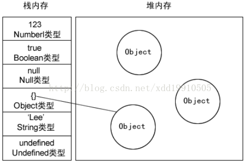

# JS的数据结构

1.  栈： 先进后出，进口和出口都是同一个。

2. 堆： 堆数据结构是一种树状结构。它的存取数据的方式与书架和书非常相似。我们只需要知道书的名字就可以直接取出书了，并不需要把上面的书取出来。JSON格式的数据中，我们存储的`key-value`可以是无序的，因为顺序的不同并不影响我们的使用，我们只需要关心书的名字。

3. 队列： 先进先出，一个入口，一个出口

4. 变量的存放

   - 基本类型： 存在于栈中，因为这些类型在内存中，有固定的大小，通过按值来访问。类型有： string, boolean, number, null, undefined, symbol 6种
   - 引用类型： 存在于堆中，无固定大小。其实在栈中，会保存引用类型的访问地址，但是实际的数据还是存放在堆中，类型： object。 
     - 当需要访问引用类型的时候，先去访问栈中的内存地址，然后根据地址去堆中找到对应的值。

    

