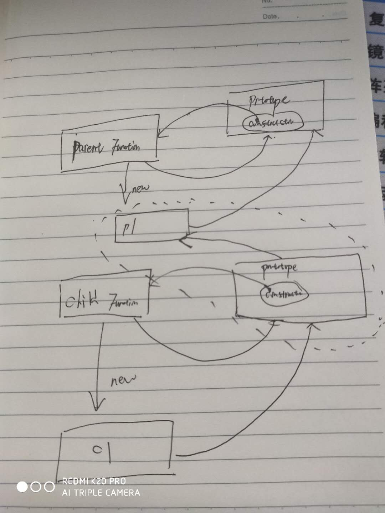
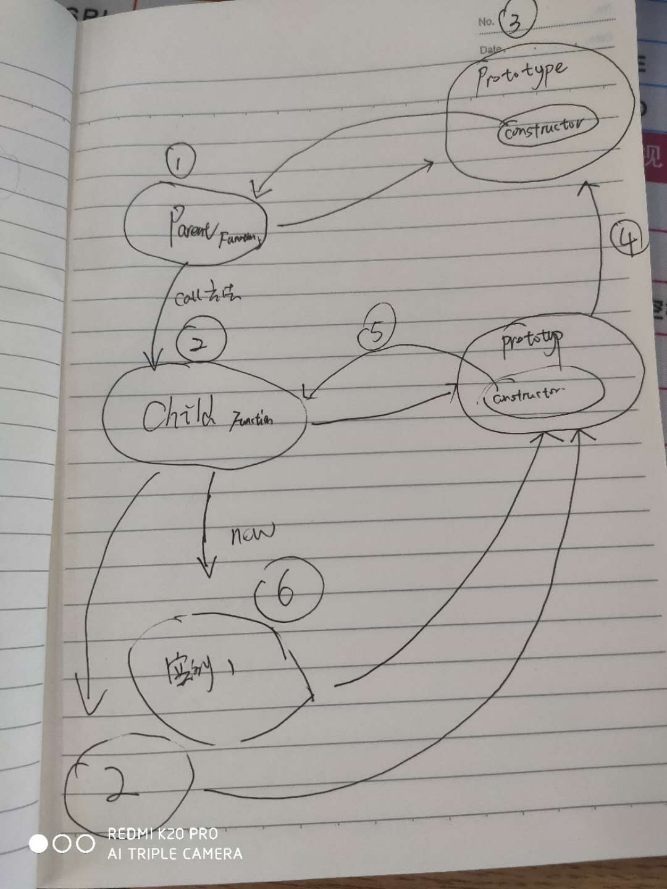
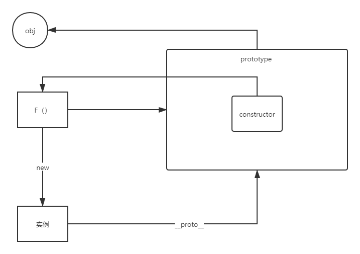
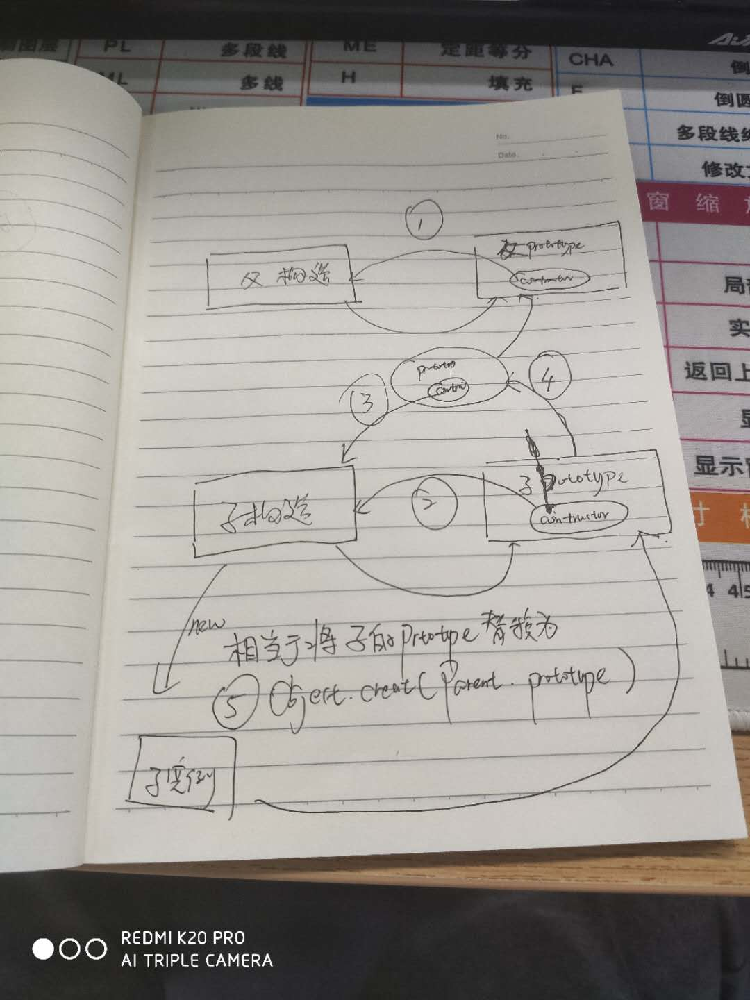

# JS继承

1.  原型链继承

   ```javascript
   // 先写两个构造函数 Parent 和 Child
   
   // Parent 构造函数
   function Parent() {
       this.name = "123";
   }
   
   // Child 构造函数
   function Child() {
       this.age = 23;
   }
   
   // Parent 构造函数的原型上挂载属性或者函数
   
   Parent.prototype.getName = function(){
       return this.name;
   }
   
   
   # 关键方式，利用new 的方式，将创建的Parent实例，实例赋值给Child.prototype
   Child.prototype = new Parent();
   
   // Child 构造函数的prototype 也拥有自己的方法
   Child.prototype.getAge = function() {
       return this.age;
   }
   
   // 最后new 一个 Child 的实例 这样既可以访问Child的属性和函数 也可以访问Parent的属性和函数
   
   var instance = new Child();
   
   
   
   # 缺点
   
   当我new 多个Child 的实例时，改变一个的值，另外一个也会接着改变
   var instance1 = new Child();
   instance1.name = "6666666"
   alert(instance1.name); //"6666666"
   
   var instance2 = new Child(); 
   alert(instance2.name); //"6666666"
   // 原型链继承
   ```

   

2. 构造函数继承

   ```javascript
   // 也就是说只使用构造函数，不使用原型，即实例没法去访问原型上的方法 关键字 call apply
   
   // Parent 构造函数
   function Parent() {
       this.name = "chenkeng";
   }
   
   function Child() {
       Parent.call(this);
   }
   
   var instance1 = new Child原型上的属性和方法();
   
   instance1.name = "fffff";
   alert(instance1.name);//"fffff"
   
   var instance2 = new Child();
   alert(instance2.name);//"chenkeng"
   
   
   # 解决了原型链继承，多个实例共享属性的问题，但是没有办法去获取Parent原型上的方法，可以访问到Child原型上的属性和方法
   ```

3. 组合式继承

   ```javascript
   // 将原型链继承 和 构造函数继承 组合起来 这样既可以访问原型上的方法和属性，也解决了多个实例共享属性的问题
   
   
   function Parent(name) {
       this.name = name;
   }
   
   function Child(name, age) {
       Parent.call(this, name);
       this.age = age;
   }
   
   Parent.prototype.getName = function (){
       return this.name;
   }
   
   // 将Child 的原型 指向 Parent 构造函的实例
   Child.prototype = new Parent();
   
   // 将自己实例中的构造函数 指回自己本身
   Child.prototype.constructor = Child;
   
   // 最后再往Child的实例上挂方法
   Child.prototype.getAge = function (){
       return this.age
   }
   
   var instance1 = new Child("123", 23);
   var instance2 = new Child("fadf"，3);
   
   # 缺点 在使用子类创建实例对象时，其原型中，会存在两份相同的属性和方法
   // 组合式继承
   ```

   

4.  原型式继承

   ```javascript
   // 原理是利用空对象作为媒介，将某个对象直接赋值给空对象构造函数的原型  浅复制
   var obj = {
       name: "123",
       age: 23
   }
   
   function object(obj) {
       // 创建一个空函数
       function F(){};
       // 将空函数的prototype 指向obj
       F.prototype = obj;
       return new F();
   }
   
   // 这样a 就可以访问到obj 的属性和方法
   var a = object(obj);
   
   #  实例a可以改变obj 的值，另外的实例也会受影响  也没有办法传递参数
   // 原型式继承
   ```

   

5. 寄生式继承

   ```javascript
   // 在原型式继承上 增强对象，返回构造函数
   
   // 就是在原型式继承函数的基础上，另外写一个函数，里面调用object 函数 生成一个对象，然后给对象上加入属性和方法 这样就增强了
   var obj = {
       name: "123",
       age: 23
   }
   
   function object(obj) {
       function F(){};
       F.prototype = obj;
       return new F();
   }
   
   function createAuther(original){
       // 用object 方法生成一个对象
       var clone = object(original);
       clone.sayHi = function (){
           alert(123)
       }
       return clone
   }
   
   var a = createAuther(obj);
   # 缺点和原生式继承是一样的
   ```

   

6.  寄生组合式继承

   ```javascript
   // 就是将第二中构造函数继承和第五种寄生式继承组合起来，做一个继承的方式
   
   function Parent(name) {
       this.name = name;
       this.colors = ["blue"];
   }
   
   function Child(name, age) {
       Parent.call(this, name);
       this.age = age;
   }
   
   Parent.prototype.getName = function () {
       return this.name;
   }
   
   // 将父类的原型 指向子类
   function inheritProperty(parent, child) {
      var prototype = Object.create(parent.prototype);
       prototype.constructor = child;
       child.prototype = prototype;
   }
   
    inheritProperty(Parent, Child);
   
   // 再去给子类的原型增加属性或者方法
   Child.prototype.getAge = function() {
       return this.age;
   }
   
   var c1 = new Child("adf", 32);
   var c2 = new Child("fasdf", 34);
   
   //这个例子的高效率体现在它只调用了一次SuperType 构造函数，并且因此避免了在SubType.prototype 上创建不必要的、多余的属性。于此同时，原型链还能保持不变；因此，还能够正常使用instanceof 和isPrototypeOf()
   //寄生组合式继承
   ```



   

   7. 混入方式继承多个对象

      ```javascript
      function MyClass() {
           SuperClass.call(this);
           OtherSuperClass.call(this);
      }
      
      // 继承一个类
      MyClass.prototype = Object.create(SuperClass.prototype);
      // 混合其它
      Object.assign(MyClass.prototype, OtherSuperClass.prototype);
      // 重新指定constructor
      MyClass.prototype.constructor = MyClass;
      
      MyClass.prototype.myMethod = function() {
           // do something
      };
      
      // Object.assign会把 OtherSuperClass原型上的函数拷贝到 MyClass原型上，使 MyClass 的所有实例都可用 OtherSuperClass 的方法。
      ```

   8.  Class 类继承
```javascript
      class Parent {
          constructor(name){
             this.name = name
          }
          
          getName(){
             return this.name;
          }
      }
      
      class Child extends Parent {
          constructor(name){
              super(name);
              this.age = 23;
          }
      }
      
      var c1 = new Child('辅导费')；
```
   9. 区别

      ES5继承和ES6继承的区别

      - ES5的继承实质上是先创建子类的实例对象，然后再将父类的方法添加到this上（Parent.call(this)）.
      - ES6的继承有所不同，实质上是先创建父类的实例对象this，然后再用子类的构造函数修改this。因为子类没有自己的this对象，所以必须先调用父类的super()方法，否则新建实例报错。

   

   

   

   

   

   


